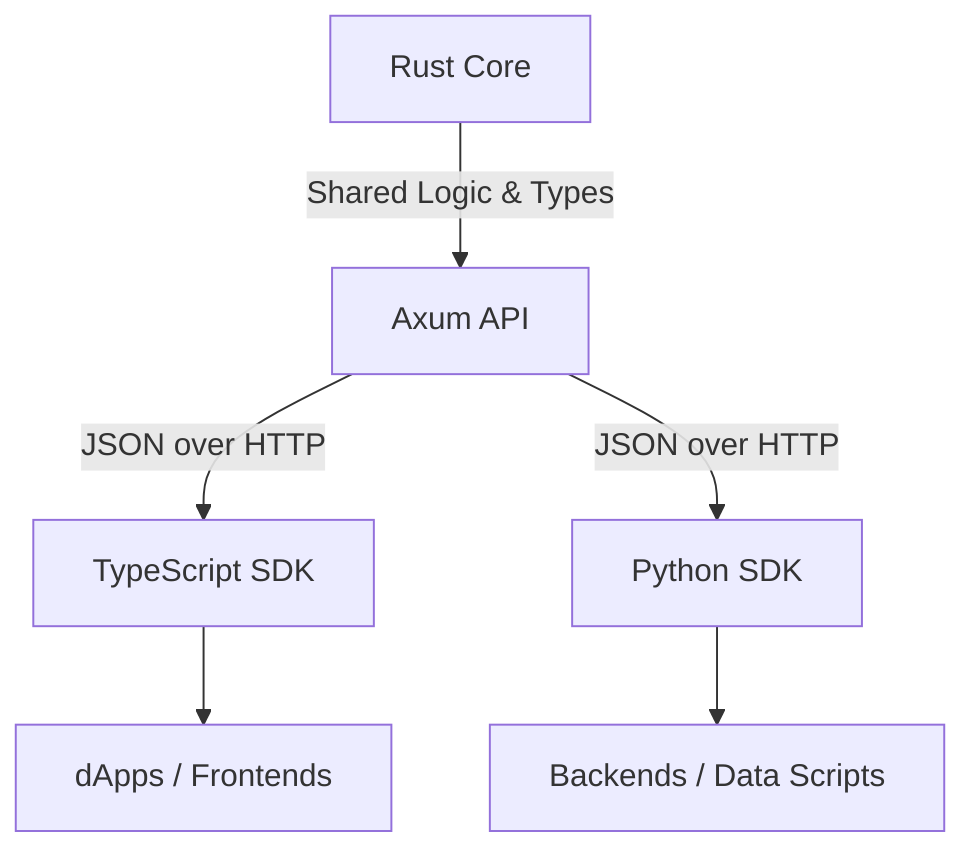

This guide explains the architectural pipeline of ChainMerge: how we transform raw blockchain data using a high-performance **Rust Core** into developer-friendly **TypeScript** and **Python** SDKs.

## 0. Foundations: What is an SDK?

An **SDK (Software Development Kit)** is a set of tools, libraries, and documentation that allows developers to build applications for a specific platform or service. 

In the context of ChainMerge, our SDKs are **"Wrapper Libraries."** Their job is to:
1.  **Abstract the Network**: Handles HTTP requests, retries, and timeouts so the user doesn't have to `fetch()` or `curl` manually.
2.  **Enforce Type Safety**: Maps loose JSON blobs into strict, language-native objects (TypeScript Interfaces or Python Dataclasses).
3.  **Provide Discoverability**: Offers IDE autocompletion (IntelliSense) for parameters and return values.

### The Philosophy: Rust-Powered, Language-Native
We write the "heavy" logic (decoding complex binary blockchain data) once in Rust. We then expose it via a standard JSON API. The SDKs then "wrap" this API, giving developer the power of Rust with the ease of the language they love.

---

## 1. Bootstrapping a New SDK (Start-to-Finish)

How do we create a new SDK (e.g., for Go or Ruby) from scratch based on the Rust core?

### Step A: Initialize the Project
Create the basic package structure in the `sdk/` directory.
- **Node/TS**: `npm init`, `tsconfig.json`.
- **Python**: `pyproject.toml`, `src/`.
- **Go**: `go mod init`.

### Step B: Define the "Wire Protocol"
Analyze the JSON output of the Rust API (`services/api`). Since the Rust core uses `serde` for serialization, we look at the Rust struct definitions to build equivalent types in the new language.

### Step C: Build the HTTP Transport
Implement a `Client` class that:
- Accepts a `baseUrl` and optional `apiKey`.
- Uses a standard HTTP library (e.g., `axios` for JS, `requests` for Python).
- Implements a generic `call(method, path, options)` method to handle headers and error parsing.

### Step D: Implement Feature Methods
Map API endpoints to native functions.
- `GET /api/decode?chain=eth&hash=...` becomes `client.decode_tx("eth", "...")`.

---

## 2. The 3-Tier Architecture

ChainMerge follows a strict 3-tier model to ensure performance, type safety, and ease of use.



### Tier 1: Rust Core (`core/chainmerge`)
The **Source of Truth**. It contains the low-level decoding logic for every supported chain.
- **Responsibility**: Fetching raw data (via RPC), validating hash formats, and normalizing into a standard schema.
- **Key Files**: `types/mod.rs` (Schema), `normalizer/mod.rs` (Logic).

### Tier 2: API Service (`services/api`)
The **Bridge**. A thin wrapper around the core using the `Axum` framework.
- **Responsibility**: Exposing the Rust functions as HTTP endpoints, handling authentication (`x-api-key`), rate limiting, and persistence (SQLite indexing).
- **Key Files**: `main.rs` (Routes & Handlers).

### Tier 3: SDKs (`sdk/js` & `sdk/python`)
The **Frontend**. Language-native libraries that consume the API.
- **Responsibility**: Providing a typed, idiomatic interface for developers so they don't have to handle raw HTTP requests or JSON parsing manually.

---

## 2. The Conversion Process

Converting a core Rust feature to an SDK feature involves four steps:

### Step 1: Define the Type in Rust
We define a new event or action in `core/chainmerge/src/types/mod.rs` using `serde`.
```rust
#[derive(Serialize, Deserialize)]
pub struct NormalizedTransaction {
    pub chain: Chain,
    pub tx_hash: String,
    pub sender: Option<String>,
    // ...
}
```

### Step 2: Expose via Axum
The API handler calls the core logic and returns the serialized JSON.
```rust
async fn decode_handler(query: Query<DecodeQuery>) -> Json<DecodeHttpResponse> {
    let decoded = chainmerge::decode_transaction(&request)?;
    Json(DecodeHttpResponse { decoded })
}
```

### Step 3: Mirror Types in SDK
We manually mirror the Rust types into the SDK's native type system.
- **TypeScript**: Interfaces in `types.ts`.
- **Python**: `@dataclass` objects in `types.py`.

### Step 4: Implement Client Method
The SDK `Client` class is updated to call the new API endpoint and cast the result into the mirrored type.

---

## 3. Data Type Mapping

| Field | Rust (Core) | TypeScript (JS SDK) | Python (SDK) |
|:--- |:--- |:--- |:--- |
| **Chain ID** | `enum Chain` | `type Chain` (Union) | `Literal` / `str` |
| **TX Hash** | `String` | `string` | `str` |
| **Optional Address**| `Option<String>` | `string \| undefined` | `str \| None` |
| **Array of Events** | `Vec<NormalizedEvent>`| `NormalizedEvent[]` | `list[NormalizedEvent]` |
| **Metadata** | `serde_json::Value` | `unknown` | `Any` |

---

## 4. Function & Output Reference

The primary goal of every SDK is the `decode` function.

### Input Parameters
- **`chain`**: `ethereum`, `solana`, `cosmos`, `aptos`, `sui`, `polkadot`, `bitcoin`, `starknet`.
- **`hash`**: The transaction identifier (hex or base58).
- **`rpcUrl`** (optional): Override for the backend's default node.

### Output Schema (`NormalizedTransaction`)
Regardless of the language, the output always follows this normalized shape:

1.  **Header Data**: `chain`, `tx_hash`, `sender`, `receiver`, `value`.
2.  **Events**: Raw, granular log-level data (e.g., specific smart contract events).
3.  **Actions**: High-level intent (e.g., "This was a **Swap** of 100 USDC for 1 SOL").

---

## 5. Why this architecture?
1.  **Consistency**: A bug fix in the Rust core automatically applies to all SDKs once the API is updated.
2.  **Speed**: Rust handles the heavy lifting of parsing binary blockchain data.
3.  **Cross-Platform**: By using a JSON API bridge, we can support any language (Go, Ruby, Java) by simply mirroring the JSON schema.
